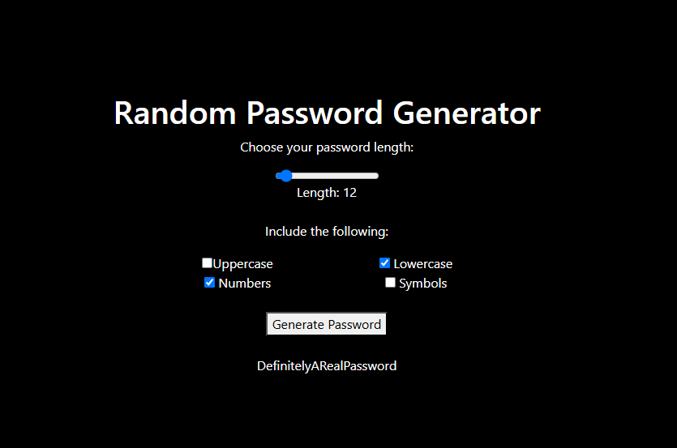

# Overengineered HTML Password Generator
I spent way too long on this... It's a web page where you can generate a password. Idk
### How to Run
1. Clone into this repository
2. Serve `index.html` with your favorite web server, or just open it in a browser
   - Requires internet access to download Bootstrap JS/CSS
4. Profit.

### Screenshot

### Features and Usage
**Password length**
- Set how many characters you want in your password with the range slider

**Password character sets**
- Enable including lowecase and uppercase letters, numbers, and symbols

# Credits (Open Source)
**Bootstrap** ([Link](https://getbootstrap.com/))
 - Licensed under MIT License
